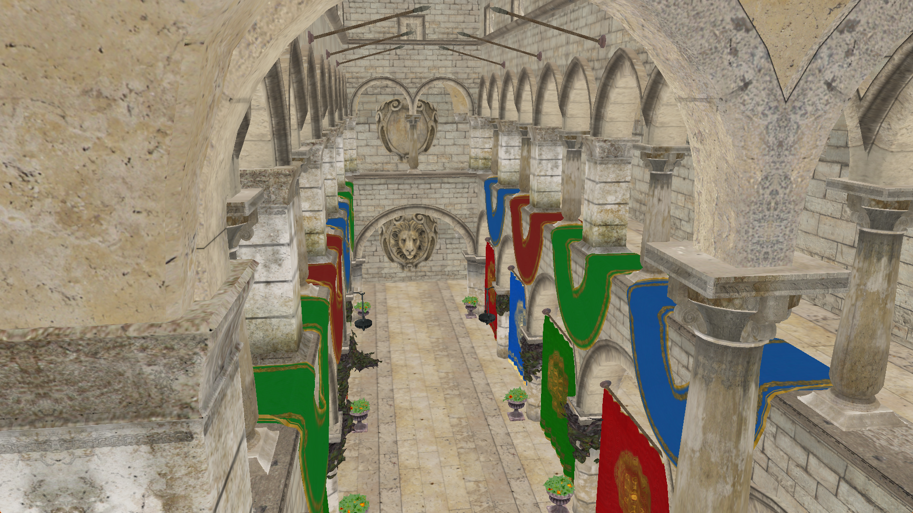

# Graphics Playground

# 

# *OpenGL sandbox for experimenting with shaders, lighting models, and 3D rendering techniques.*

# 

# This project supports:

# - Loading 3D models (e.g., Sponza)

# - Multi-texture materials (diffuse, specular, normal maps)

# - Custom shaders for lighting, PBR, and visual effects

# - Adjustable camera and projection settings

# 

# ---

# 

# ## Screenshot

# 

#   

# 

# ---

# 

# ## Features

# 

# - **Model Loading**: Supports `.obj`, `.fbx`, `.dae` via Assimp  

# - **Texture Support**: Diffuse, specular, normal, and height maps  

# - **Shader Playground**: Easily swap shaders to experiment with:

# &nbsp; - Phong lighting

# &nbsp; - Normal mapping

# &nbsp; - Specular highlights

# &nbsp; - Shadow mapping (future)  

# - **Camera Controls**: Fly through large scenes with adjustable FOV, near/far planes

# - **SDL2 Integration**: Handles windowing, input, and OpenGL context creation

# ---

# 

# ## Getting Started

# 

# ### Prerequisites

# - C++17 compiler

# - OpenGL 3.3+ context

# - Libraries:

# &nbsp; - [SDL2](https://www.libsdl.org/)

# &nbsp; - [GLAD](https://github.com/Dav1dde/glad)

# &nbsp; - [GLM](https://glm.g-truc.net/0.9.9/index.html)

# &nbsp; - [Assimp](https://github.com/assimp/assimp)

# &nbsp; - [stb_image](https://github.com/nothings/stb)

